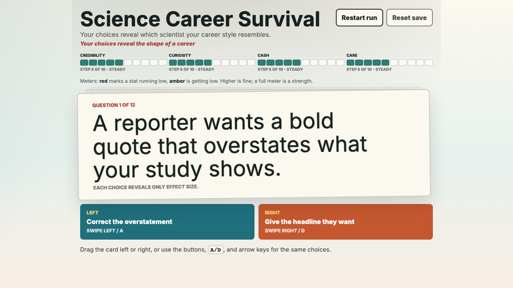
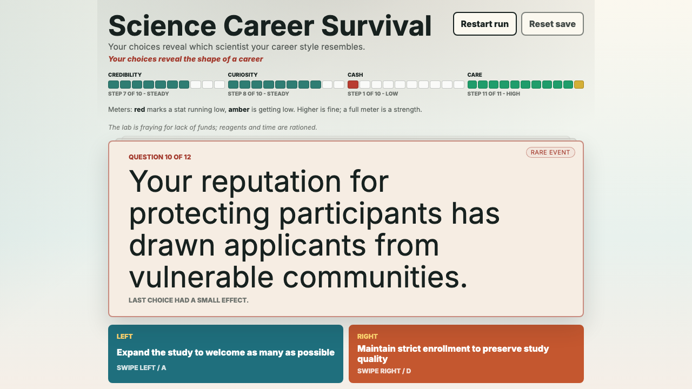
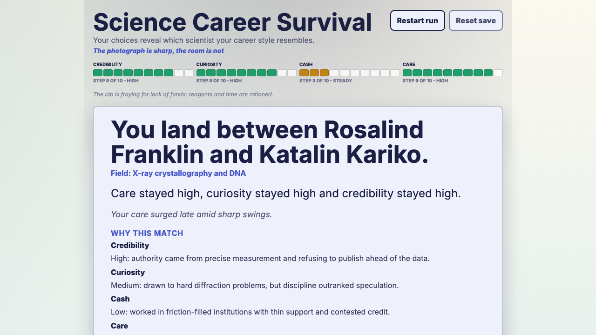

# Science Career Survival

A static TypeScript browser game where your choices across 12 career dilemmas reveal which historically inspired scientist (or, on a downfall, which cautionary case) your career style most resembles, built on a shared, scientist-neutral deck.

Play it live: [vosslab.github.io/science-choose-adventure](https://vosslab.github.io/science-choose-adventure/)

## Quick start

```bash
npm install
./check_codebase.sh   # typecheck, lint, format, node unit tests
./run_web_server.sh   # build dist/ and serve locally (auto-opens browser)
```

The `npm run` equivalents (`npm run check`, `npm run build`, `npm run serve`) are also available.

## Game overview

This is a pilot of the resemblance redesign. You answer 12 career-dilemma questions
drawn blind from a shared neutral deck. Some questions carry a disguised scientist
flavor, but the deck is otherwise undifferentiated -- you never choose a scientist
up front and there are no scientist-specific paths.

Your choices shift four career stats across the run:

- Credibility
- Curiosity
- Cash
- Care

Stats are floored at 0 with no upper cap. Low stats add soft "strain" texture to
the wording. Pushing a stat past 100 sends it into an extreme band: the meter grows
extra gold segments, and the extreme reroutes your ending toward a cautionary case.

At the end, the game routes to one of two reveal pools. An honest run compares your
final stat profile to hand-authored signatures for five celebrated scientists and
reveals which one you most resemble:

- Jennifer Doudna
- Rosalind Franklin
- Marie Curie
- Alexander Fleming
- Katalin Kariko

A downfall -- credibility collapsing to the floor, or any stat pushed to an extreme --
instead routes to one of nine cautionary science and biotech cases, revealing which
case your choices echo. The reveal includes a plain-language explanation, a per-stat
rationale for the match, an ordered ranking of the matched pool against your profile,
and unlocked source notes about the matched outcome.

The matching uses a normalized, weighted, shape-aware metric: per-axis z-score
normalization (so a stat with naturally wider spread does not dominate), per-scientist
axis weights (each signature emphasizes its defining Cs), and a cosine-similarity term
that nudges apart profiles with the same distances but different shapes. When the top
two resemblance scores are close, the result blends toward both: celebrated runs may
read "You land between X and Y." and downfall runs "Your choices echo both the X and Y
cases." A trajectory note summarizes the run shape -- which stat peaked, whether it
peaked early or late, and whether the path was steady or swinging.

Cards can carry conditional effects: the same choice may land differently depending on
your current stats (for example, a cash-heavy run may convert a moderate effect into a
stronger one). Some choices unlock a follow-up card that appears deterministically on
the next draw. Pushing a stat into the extreme band can trigger rare event cards gated
on that extreme. A cooldown prevents any recently-asked core card from reappearing,
keeping each run distinct.

The interface supports mobile swipe, touch or click buttons, and keyboard input.
Use left arrow or `A` for the left choice, and right arrow or `D` for the right
choice. For the intended layout, play on a desktop browser window roughly 16:9
to 16:10 in aspect ratio, or a phone held vertically at about 10:16.

## Screenshots

<!-- screenshots:begin (managed by screenshot-docs) -->



<!-- screenshots:end -->

## Shell scripts

| Script | What it does |
| --- | --- |
| `./run_web_server.sh` | Builds `dist/` then serves it locally on a random port (8000-8999); auto-opens the browser when running interactively |
| `./build_github_pages.sh` | Wipes and rebuilds the `dist/` GitHub Pages artifact (type-checks, bundles via esbuild, copies static assets) |
| `./check_codebase.sh` | Runs typecheck, ESLint (zero warnings), Prettier check, and Node unit tests; no build step |

## Documentation

Launch content uses `data/science_career_paths/` as source material for
scientist signatures and source notes. Runtime cards live in TypeScript source.

- [docs/INSTALL.md](docs/INSTALL.md)
- [docs/USAGE.md](docs/USAGE.md)
- [docs/CODE_ARCHITECTURE.md](docs/CODE_ARCHITECTURE.md)
- [docs/FILE_STRUCTURE.md](docs/FILE_STRUCTURE.md)
- [docs/FILE_FORMATS.md](docs/FILE_FORMATS.md)
- [docs/TROUBLESHOOTING.md](docs/TROUBLESHOOTING.md)
- [docs/TYPESCRIPT_STYLE.md](docs/TYPESCRIPT_STYLE.md)
- [docs/CHANGELOG.md](docs/CHANGELOG.md)
