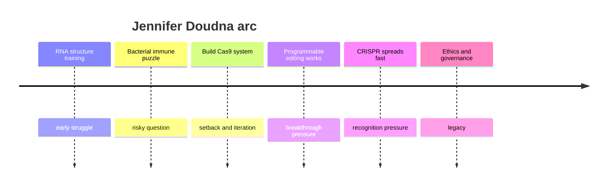
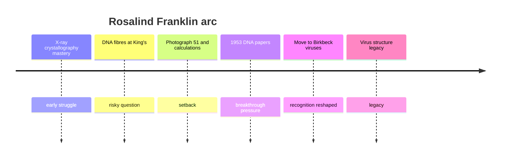
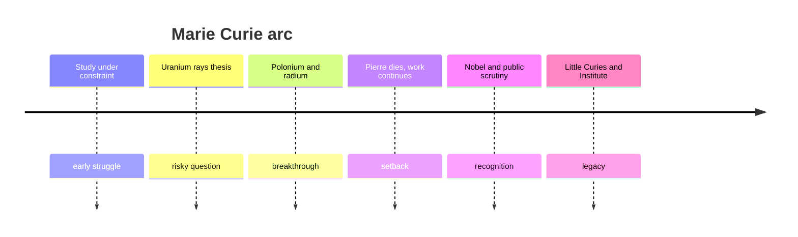
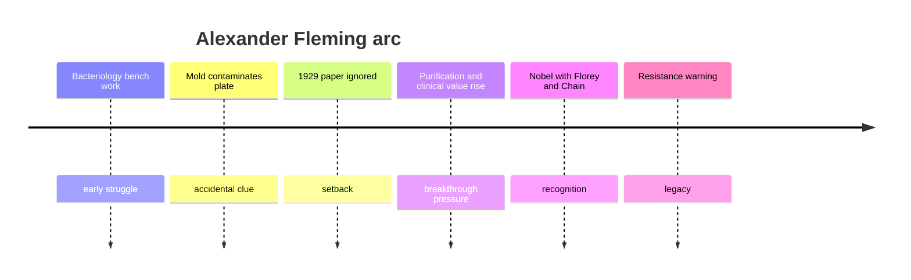
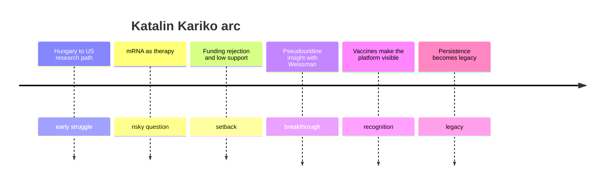

# LLM reviewer research output

## Executive summary

For a first set of improved Markdown path files, **Katalin Kariko** is the strongest first-play sample: her story maps cleanly onto the four-stat loop, the stakes are legible to students, and the core tension-keep chasing a risky molecule or switch to safer work-naturally generates gray-area choices. **Rosalind Franklin** is the strongest second sample for credit and evidence; **Alexander Fleming** is the easiest for accidental discovery and downstream consequences; **Marie Curie** gives the clearest "discovery has a cost" arc; **Jennifer Doudna** adds modern ethics and scientific power. Across the five, the best narrative structure is a short fixed mini-arc with lightly shuffled cards: early struggle, risky question, setback, breakthrough pressure, recognition pressure, legacy. That gives enough plot shape without the testing burden of branching chapters.

The biggest factual risk is **oversimplifying credit disputes or institutional treatment**. Franklin's contribution to DNA structure is secure, but motives, permission, and "who stole what" language remain historically sensitive; similarly, Kariko's repeated rejection is well attested in interviews and profiles, but some specifics of promotion/demotion are not easy to anchor in a primary institutional record. Curie's illness should not be treated as a punchline, and Fleming's "lucky mold" story should not erase later purification work by Florey and Chain. Doudna's path should foreground ethics and public responsibility without turning into a patent or scandal simulator.

## Cross-scientist comparison

This comparison is a design synthesis from the source set below: Nobel records, institutional biographies, original papers, and Britannica.

| Scientist | Ethics | Credit | Resource scarcity | Accidental discovery | Persistence | Best gameplay tension |
|---|---|---:|---:|---:|---:|---|
| Jennifer Doudna | High | Medium | Medium | Low | High | power vs responsibility |
| Rosalind Franklin | Medium | Very high | Medium | Low | High | evidence vs recognition |
| Marie Curie | Medium | High | Very high | Low | Very high | discovery vs bodily cost |
| Alexander Fleming | Medium | Medium | Medium | Very high | Medium | accident vs follow-through |
| Katalin Kariko | Medium | Medium | Very high | Low | Very high | risky idea vs career survival |

**Suggested first-play sample: Katalin Kariko.** Her path is unusually clear for high-school players: repeated grant rejection, collaborator search, immune-response problem, delayed recognition, and a strong legacy payoff. The player can feel every tradeoff in Credibility, Curiosity, Cash, and Capacity without needing much historical background.

## Jennifer Doudna

Doudna won the 2020 Nobel Prize in Chemistry for genome editing work with Emmanuelle Charpentier, and the core scientific turning point is well anchored in the 2012 *Science* paper showing programmable Cas9 cleavage. Her earlier career in RNA structure and her later public role in CRISPR ethics make her path especially good for "tool becomes bigger than the lab" storytelling. citeturn1search0turn1search5turn1search1turn4search0



```md
# jennifer_doudna.md

## Sources
- https://www.nobelprize.org/prizes/chemistry/2020/doudna/facts/
- https://www.nobelprize.org/prizes/chemistry/2020/doudna/biographical/
- https://www.science.org/doi/pdf/10.1126/science.1225829
- https://innovativegenomics.org/people/jennifer-doudna/

## Arc beats
Early RNA work; strange bacterial defense clue; collaboration risk; lab proof of programmable Cas9; fast adoption and ethics pressure; legacy as builder and public guide.

## Motifs
- scissors and signatures
- code that edits the coder

## Cards
1. Odd bacterial repeats keep appearing. L: Follow the repeat `[Curiosity/Credibility SMALL]` label `Follow clue` | R: Stay on safer RNA `[Cash/Capacity SMALL]` label `Stay safer`
2. A collaborator proposes a bold test. L: Share the problem `[Credibility/Curiosity MED]` `Open notebook` | R: Guard the project `[Cash/Credibility MED]` `Protect lead`
3. The system cuts badly in early trials. L: Rebuild patiently `[Capacity/Credibility SMALL]` `Rebuild` | R: Push a quick demo `[Cash/Curiosity MED]` `Push demo`
4. A simpler guide RNA might work. L: Try the cleaner design `[Curiosity/Credibility LARGE]` `Try cleaner guide` | R: Keep the older setup `[Capacity/Cash SMALL]` `Keep setup`
5. Reviewers want stronger evidence. L: Run more controls `[Credibility/Capacity MED]` `Add controls` | R: Publish the core idea now `[Cash/Curiosity MED]` `Publish early`
6. Headlines start outrunning the data. L: Slow the story down `[Credibility/Cash MED]` `Slow down` | R: Use the spotlight `[Cash/Capacity SMALL]` `Use spotlight`
7. A company offers fast resources. L: Take partnership money `[Cash/Credibility MED]` `Take funding` | R: Keep academic distance `[Curiosity/Capacity SMALL]` `Stay independent`
8. Human embryo editing enters the debate. L: Call for guardrails `[Credibility/Cash MED]` `Ask for guardrails` | R: Defend open experimentation `[Curiosity/Credibility LARGE]` `Defend openness`
9. Students want the tool everywhere. L: Teach broad use `[Legacy/Curiosity MED]` `Teach widely` | R: Limit access for now `[Credibility/Capacity SMALL]` `Limit access`
10. Patent conflict eats lab time. L: Fight hard `[Cash/Credibility MED]` `Fight claim` | R: Refocus on science `[Capacity/Curiosity SMALL]` `Refocus`
11. New applications appear each week. L: Chase many fields `[Curiosity/Capacity MED]` `Chase many` | R: Build one careful path `[Credibility/Cash SMALL]` `Pick one`
12. Public trust feels fragile. L: Speak plainly about limits `[Credibility/Capacity SMALL]` `Name limits` | R: Promise transformation `[Cash/Credibility MED]` `Sell future`

## Collapse endings
- Credibility: too low, the field stops trusting your claims; too high, you start protecting institutions more than questions.
- Curiosity: too low, the work becomes efficient but small; too high, the lab fragments into too many futures.
- Cash: too low, the project stalls; too high, funders set the agenda.
- Capacity: too low, burnout empties the work; too high, caution freezes the bold next step.

## Source notes
- The programmable Cas9 turning point is primary-source solid.
- Doudna's public ethics role is well supported by IGI and Nobel materials.
- Patent details are real but not central here; keep cards focused on science and responsibility.
- Avoid saying Doudna "invented gene editing"; say she co-developed a transformative CRISPR method.

## Tone guardrail
Respect the scale of CRISPR without treating power as triumph. The joke target is hype and governance confusion, not patients or disability.
```

## Rosalind Franklin

Franklin's King's College work, Photograph 51, and the 1953 *Nature* paper with Raymond Gosling are secure anchors. Her later virus work at Birkbeck is equally important and helps avoid reducing her path to a single grievance narrative. The safest framing is "clear evidence in a difficult professional environment," not "martyr genius." citeturn0search4turn0search0turn2search2turn4search2



```md
# rosalind_franklin.md

## Sources
- https://www.kcl.ac.uk/people/rosalind-franklin
- https://www.kcl.ac.uk/the-story-behind-photograph-51
- https://www.nature.com/articles/171740a0
- https://profiles.nlm.nih.gov/spotlight/kr/feature/viruses

## Arc beats
Technical mastery; difficult lab politics; DNA diffraction and careful interpretation; pressure for faster claims; move to Birkbeck; broader legacy in virus structure.

## Motifs
- the photograph is sharp, the room is not
- let the pattern speak

## Cards
1. The fibres finally diffract cleanly. L: Measure longer `[Credibility/Capacity SMALL]` `Measure longer` | R: Sketch a bold model `[Curiosity/Credibility MED]` `Sketch model`
2. A colleague wants quick conclusions. L: Hold for cleaner data `[Credibility/Cash SMALL]` `Hold back` | R: Share the exciting hint `[Cash/Credibility MED]` `Share hint`
3. Your camera run takes days. L: Protect machine time `[Credibility/Cash SMALL]` `Book more time` | R: Split time politically `[Capacity/Credibility SMALL]` `Share lab`
4. The wet form looks suggestive. L: Pursue the helix carefully `[Curiosity/Credibility MED]` `Test helix` | R: Focus on the hard math first `[Credibility/Capacity SMALL]` `Do the math`
5. The room favors confident talkers. L: Speak harder in meetings `[Credibility/Capacity MED]` `Push back` | R: Let the data accumulate `[Credibility/Cash SMALL]` `Wait for proof`
6. Another team moves faster. L: Race them `[Curiosity/Capacity MED]` `Race` | R: Keep methodical standards `[Credibility/Cash SMALL]` `Keep standards`
7. Your student needs direction. L: Train patiently `[Capacity/Credibility SMALL]` `Teach carefully` | R: Demand speed `[Cash/Capacity SMALL]` `Push pace`
8. The DNA story becomes crowded. L: Narrow to strongest evidence `[Credibility/Curiosity SMALL]` `Narrow focus` | R: Broaden the claim `[Cash/Credibility MED]` `Broaden claim`
9. Birkbeck offers a better fit. L: Move and reset `[Capacity/Curiosity MED]` `Move labs` | R: Stay and fight `[Credibility/Cash MED]` `Stay put`
10. Virus work opens a new puzzle. L: Start again boldly `[Curiosity/Capacity SMALL]` `Start new puzzle` | R: Keep defending past work `[Credibility/Cash SMALL]` `Defend old work`
11. Recognition arrives unevenly. L: Correct the record `[Credibility/Capacity MED]` `Correct record` | R: Let the papers stand `[Curiosity/Credibility SMALL]` `Let work stand`
12. A neat story tempts the press. L: Simplify for attention `[Cash/Credibility MED]` `Simplify` | R: Keep the science exact `[Credibility/Capacity SMALL]` `Keep exact`

## Collapse endings
- Credibility: too low, precision gets ignored; too high, you become trapped defending perfect method over timely action.
- Curiosity: too low, the work narrows into service work; too high, every pattern becomes a new maze.
- Cash: too low, instrument access disappears; too high, visibility politics starts steering the project.
- Capacity: too low, exhaustion beats the notebook; too high, overcontrol slows every human exchange.

## Source notes
- Franklin's DNA contribution is beyond dispute.
- The exact permission/history around Photograph 51 is sensitive; avoid villain language unless a card cites a specific source.
- [CLAIM NEEDS STRONGER PRIMARY SUPPORT] "Franklin would certainly have won a Nobel" is speculative.
- Include her virus work so the path is not only about DNA.

## Tone guardrail
Treat unfairness seriously, but do not flatten Franklin into a symbol of victimhood. She is a rigorous scientist with more than one major contribution.
```

## Marie Curie

Curie's biography is unusually strong for a plotted mini-arc: barriers to study in Warsaw, doctoral work on radioactivity, discovery of polonium and radium, Nobel recognition, and wartime radiology. Her path should teach that discovery, reputation, and bodily cost can rise together. citeturn6search9turn1search3turn3search2turn6search1



```md
# marie_curie.md

## Sources
- https://www.nobelprize.org/prizes/physics/1903/marie-curie/biographical/
- https://www.nobelprize.org/prizes/chemistry/1911/marie-curie/facts/
- https://www.nobelprize.org/prizes/chemistry/1911/marie-curie/lecture/
- https://www.nobelprize.org/stories/women-who-changed-science/marie-curie/

## Arc beats
Study despite barriers; thesis on uranium rays; discovery and isolation grind; grief and continuation after Pierre's death; dual Nobel-era pressure; wartime radiology and institute legacy.

## Motifs
- the glow is beautiful and dangerous
- measure first, admire later

## Cards
1. The lab space is poor and cold. L: Work anyway `[Curiosity/Capacity SMALL]` `Work anyway` | R: Wait for better support `[Cash/Capacity SMALL]` `Wait`
2. Pitchblende reads hotter than uranium. L: Chase the anomaly `[Curiosity/Credibility MED]` `Chase anomaly` | R: Stay with cleaner cases `[Capacity/Cash SMALL]` `Stay cleaner`
3. Refining ore takes endless labor. L: Keep stirring and measuring `[Credibility/Capacity MED]` `Keep refining` | R: Publish partial clues `[Cash/Credibility SMALL]` `Publish clue`
4. A new element needs a name. L: Signal Poland `[Credibility/Cash SMALL]` `Name it boldly` | R: Keep the paper neutral `[Credibility/Capacity SMALL]` `Stay neutral`
5. Fame arrives before safety rules do. L: Accept public attention `[Cash/Credibility MED]` `Face public` | R: Hide in the lab `[Capacity/Curiosity SMALL]` `Stay in lab`
6. The work is physically punishing. L: Slow down `[Capacity/Credibility SMALL]` `Slow down` | R: Push for isolation `[Curiosity/Capacity MED]` `Push on`
7. After Pierre's death, the chair opens. L: Take it and continue `[Credibility/Capacity MED]` `Continue` | R: Step back from the spotlight `[Capacity/Cash SMALL]` `Step back`
8. A scandal distracts from the science. L: Defend your private life `[Capacity/Credibility MED]` `Defend self` | R: Let the work answer `[Credibility/Cash SMALL]` `Let work stand`
9. War changes the problem. L: Build mobile X-rays `[Curiosity/Capacity MED]` `Build mobile units` | R: Protect the lab's pure research `[Credibility/Cash SMALL]` `Protect lab`
10. Students need training. L: Grow the institute `[Legacy/Credibility SMALL]` `Train others` | R: Keep the bench to yourself `[Curiosity/Cash SMALL]` `Keep bench`
11. Radium attracts money and myth. L: Correct exaggeration `[Credibility/Cash SMALL]` `Correct myth` | R: Use fascination to fund work `[Cash/Credibility MED]` `Use fascination`
12. Recognition keeps climbing. L: Guard scientific standards `[Credibility/Capacity SMALL]` `Guard standards` | R: Become a national symbol `[Cash/Capacity MED]` `Carry symbol`

## Collapse endings
- Credibility: too low, your measurements are dismissed; too high, you become a monument before the work is done.
- Curiosity: too low, the lab becomes routine; too high, you ignore warning signs in pursuit of the next glow.
- Cash: too low, materials and instruments vanish; too high, public fascination distorts the science.
- Capacity: too low, strain and exposure end the run; too high, caution keeps the discovery unfinished.

## Source notes
- Curie's Nobel milestones and wartime X-ray work are secure.
- Use respectful wording around illness and radiation exposure.
- [CLAIM NEEDS STRONGER PRIMARY SUPPORT] Direct single-cause statements about her death should be avoided; exposure came from multiple sources over years.
- Keep jokes aimed at institutions and unsafe conditions, not at suffering.

## Tone guardrail
Awe and danger must coexist. Never turn radiation sickness into a punchline.
```

## Alexander Fleming

Fleming's path is best when it starts with messy bacteriology, not instant legend. The 1929 paper and his Nobel lecture support the core beats: an unexpected mold effect, slow uptake because purification was hard, later medical success with Florey and Chain, and an early warning about resistance. citeturn2search11turn0search2turn4search7turn6search7



```md
# alexander_fleming.md

## Sources
- https://www.nobelprize.org/prizes/medicine/1945/fleming/biographical/
- https://www.nobelprize.org/prizes/medicine/1945/fleming/lecture/
- https://europepmc.org/articles/PMC2048009
- https://www.britannica.com/biography/Alexander-Fleming

## Arc beats
Routine bacteriology; contaminated plate; publish the odd result; difficulty making penicillin useful; later wartime impact; warning about resistance.

## Motifs
- the dirty bench tells the truth
- luck favors the watcher

## Cards
1. A plate grows mold where bacteria should be. L: Study the contamination `[Curiosity/Credibility SMALL]` `Study mold` | R: Bin the spoiled plate `[Capacity/Cash SMALL]` `Bin plate`
2. The effect looks real but messy. L: Repeat carefully `[Credibility/Capacity SMALL]` `Repeat test` | R: Announce a promising killer `[Cash/Credibility MED]` `Announce`
3. The broth works poorly in bulk. L: Admit the limit `[Credibility/Cash SMALL]` `Admit limit` | R: Push the story anyway `[Cash/Credibility MED]` `Push story`
4. Colleagues stay unconvinced. L: Keep publishing evidence `[Credibility/Curiosity SMALL]` `Publish evidence` | R: Move to easier projects `[Capacity/Cash SMALL]` `Move on`
5. Clinical use needs chemistry help. L: Share credit widely `[Credibility/Capacity SMALL]` `Share credit` | R: Defend discovery ownership `[Cash/Credibility MED]` `Defend claim`
6. Penicillin starts saving lives. L: Speak about teamwork `[Credibility/Capacity SMALL]` `Name team` | R: Lean into fame `[Cash/Credibility MED]` `Lean into fame`
7. Demand outruns supply. L: Set careful expectations `[Credibility/Cash SMALL]` `Set limits` | R: Let hope outrun stock `[Cash/Credibility MED]` `Promise more`
8. The press loves miracle language. L: Resist the miracle story `[Credibility/Capacity SMALL]` `Resist hype` | R: Use it to build support `[Cash/Credibility MED]` `Use hype`
9. Patients want penicillin for everything. L: Warn about misuse `[Credibility/Cash SMALL]` `Warn misuse` | R: Let access expand fast `[Cash/Capacity SMALL]` `Expand access`
10. Your lecture can celebrate or caution. L: Warn about resistance `[Credibility/Curiosity SMALL]` `Give warning` | R: Give a victory speech `[Cash/Credibility SMALL]` `Celebrate`
11. Another odd mold appears. L: Chase the next accident `[Curiosity/Capacity SMALL]` `Chase oddity` | R: Consolidate what works `[Cash/Credibility SMALL]` `Consolidate`
12. History starts simplifying everything. L: Correct the lone-genius myth `[Credibility/Capacity SMALL]` `Correct myth` | R: Let the clean legend stand `[Cash/Credibility MED]` `Keep legend`

## Collapse endings
- Credibility: too low, the odd result stays a curiosity; too high, you start defending one story more than the shared record.
- Curiosity: too low, the accidental clue is lost; too high, you chase every contamination and finish nothing.
- Cash: too low, the work never scales; too high, miracle branding outruns responsible use.
- Capacity: too low, the grind defeats follow-through; too high, excessive caution leaves lifesaving work unfinished.

## Source notes
- The 1929 paper is the anchor for the accidental observation.
- Keep Florey and Chain visible in recognition cards.
- Fleming's resistance warning is primary-source solid from the Nobel lecture.
- Avoid "Fleming alone created penicillin medicine."

## Tone guardrail
Play the irony of messy labs and miracle headlines, not patient suffering.
```

## Katalin Kariko

Kariko's Penn and Nobel materials support the key arc: long commitment to mRNA, collaboration with Drew Weissman, the 2005 modified-nucleoside breakthrough, and the later centrality of that work to effective mRNA COVID-19 vaccines. This is the clearest path for "years of rejection before one yes." citeturn5search2turn5search6turn4search1turn0search3turn5search1



```md
# katalin_kariko.md

## Sources
- https://www.nobelprize.org/prizes/medicine/2023/kariko/facts/
- https://www.nobelprize.org/prizes/medicine/2023/kariko/interview/
- https://www.pennmedicine.org/providers/katalin-kariko
- https://www.cell.com/immunity/fulltext/S1074-7613%2805%2900211-6

## Arc beats
Immigration and RNA focus; mRNA looks unfundable; collaborator match with Weissman; immune-response problem; nucleoside modification breakthrough; vaccine-era recognition and broader platform legacy.

## Motifs
- decades of no before one yes
- the molecule keeps saying maybe

## Cards
1. Everyone says mRNA is too unstable. L: Keep the molecule `[Curiosity/Capacity SMALL]` `Keep mRNA` | R: Switch to safer work `[Cash/Capacity SMALL]` `Switch topic`
2. Grants keep coming back rejected. L: Rewrite and persist `[Capacity/Credibility SMALL]` `Rewrite` | R: Follow funder fashion `[Cash/Curiosity SMALL]` `Follow fashion`
3. A nearby immunologist might help. L: Start the partnership `[Credibility/Curiosity MED]` `Find ally` | R: Keep the project solo `[Capacity/Cash SMALL]` `Stay solo`
4. Synthetic RNA triggers inflammation. L: Treat the failure as data `[Curiosity/Credibility SMALL]` `Study failure` | R: Call the platform broken `[Capacity/Cash SMALL]` `Call it broken`
5. Modified nucleosides look promising. L: Push the chemistry `[Curiosity/Credibility MED]` `Modify RNA` | R: Keep simpler constructs `[Cash/Capacity SMALL]` `Keep simple`
6. The paper seems too niche to matter. L: Publish anyway `[Credibility/Curiosity SMALL]` `Publish` | R: Wait for a flashier result `[Cash/Capacity SMALL]` `Wait`
7. Industry shows new interest. L: Join translational work `[Cash/Curiosity MED]` `Translate` | R: Stay fully academic `[Credibility/Capacity SMALL]` `Stay academic`
8. A crisis makes mRNA suddenly urgent. L: Move fast with partners `[Cash/Credibility MED]` `Move fast` | R: Insist on slower proof `[Credibility/Capacity SMALL]` `Slow proof`
9. Recognition arrives after years offstage. L: Tell the long story `[Credibility/Capacity SMALL]` `Tell long story` | R: Let the miracle narrative run `[Cash/Credibility MED]` `Use miracle story`
10. Students ask how to survive rejection. L: Teach resilience `[Capacity/Credibility SMALL]` `Teach resilience` | R: Teach strategy first `[Cash/Credibility SMALL]` `Teach strategy`
11. New platforms want your name. L: Back many applications `[Curiosity/Cash MED]` `Back many` | R: Protect a narrower standard `[Credibility/Capacity SMALL]` `Protect standard`
12. The molecule now has political weight. L: Keep talking science `[Credibility/Capacity SMALL]` `Keep to science` | R: Become a public symbol `[Cash/Capacity MED]` `Carry symbol`

## Collapse endings
- Credibility: too low, your data stay easy to dismiss; too high, your name becomes safer than your science.
- Curiosity: too low, you abandon the molecule too early; too high, you bet everything on elegance and miss translation.
- Cash: too low, the lab cannot survive; too high, urgency and industry start writing the questions.
- Capacity: too low, rejection hollows out the work; too high, self-protection freezes the next leap.

## Source notes
- The 2005 modified-nucleoside paper is the key primary anchor.
- Penn and Nobel sources support the long-term RNA focus and Weissman collaboration.
- [CLAIM NEEDS STRONGER PRIMARY SUPPORT] Specific promotion/demotion stories are widely repeated, but I did not locate a primary institutional record in this pass.
- Use "repeated rejection and low support," which is well supported, instead of unverifiable HR detail.

## Tone guardrail
Make the system, not the scientist, the object of satire. Persistence should feel costly, not magically rewarded.
```
